# TaskHub: A Project Management Tool

TaskHub is a full-stack application designed to help teams manage their projects and tasks efficiently. It provides a collaborative environment where users can organize their work, track progress, and communicate effectively.

## Key Features

- **User Authentication**: Secure sign-up and sign-in functionality to protect user data. Forgot password, Email Verification, Reset Password functionalities.
- **Workspace Management**:
  - Create dedicated workspaces for different teams or projects.
  - Invite teammates via a unique link or email to collaborate in real-time.
- **Project Tracking**:
  - Create and manage projects within each workspace.
  - Get a clear overview of all your projects in one place.
- **Task Management**:
  - Break down projects into smaller, manageable tasks.
  - Assign tasks to team members and set priorities and statuses.
  - Add detailed descriptions, sub-tasks, and comments for clear communication.
- **Dashboard**:
  - A comprehensive dashboard to visualize project statistics and recent activities.
  - Keep track of upcoming tasks and your personal assignments.
- **User Profiles**:
  - Manage your user profile and settings.
- **Security**:
  - Employs Arcjet for rate limiting ,bot protection and validation of emails to prevent disposable addresses and emails without MX records to secure the application.
- **Email Notifications**:
  - Utilizes SendGrid to send transactional emails for events like email verification and workspace invitations.

## Tech Stack

- **Frontend**: React, Vite, Tailwind CSS
- **Backend**: Node.js, Express, MongoDB
- **Authentication**: JWT (JSON Web Tokens)

## Services Used

- **Arcjet**: For security features like rate limiting, bot protection, and validation of emails to prevent disposable addresses and emails without MX records.
- **SendGrid**: For sending transactional emails. 

## Screenshots

| Feature | Screenshot |
| :---: | :---: |
| **Home Page** | 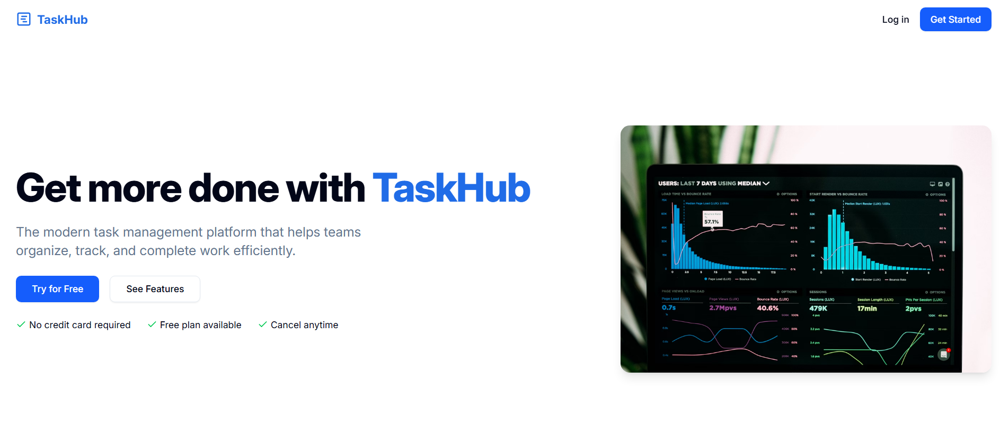 |
| **Working Overview** | 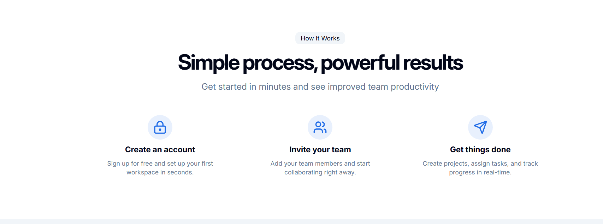 |
| **Features Overview** | 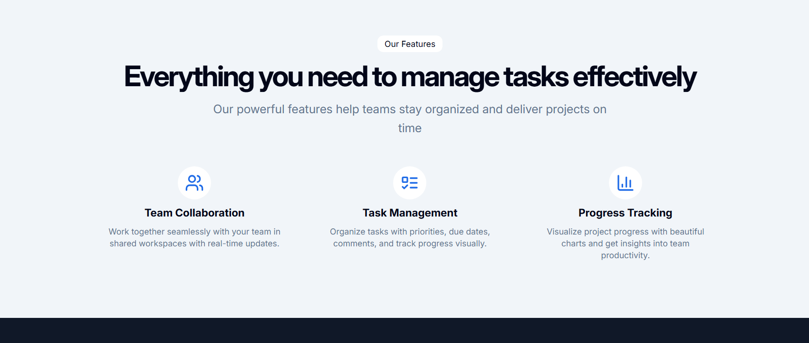 |
| **Create Project** | 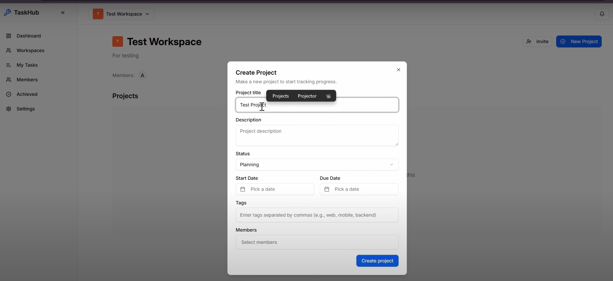 |
| **Project Tracking** | 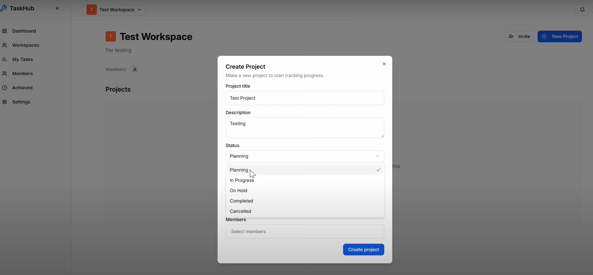 |
| **Adding Deadlines** | 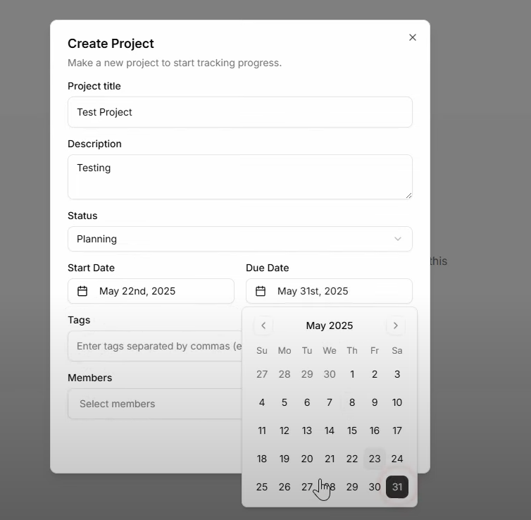 |
| **Task Details** | 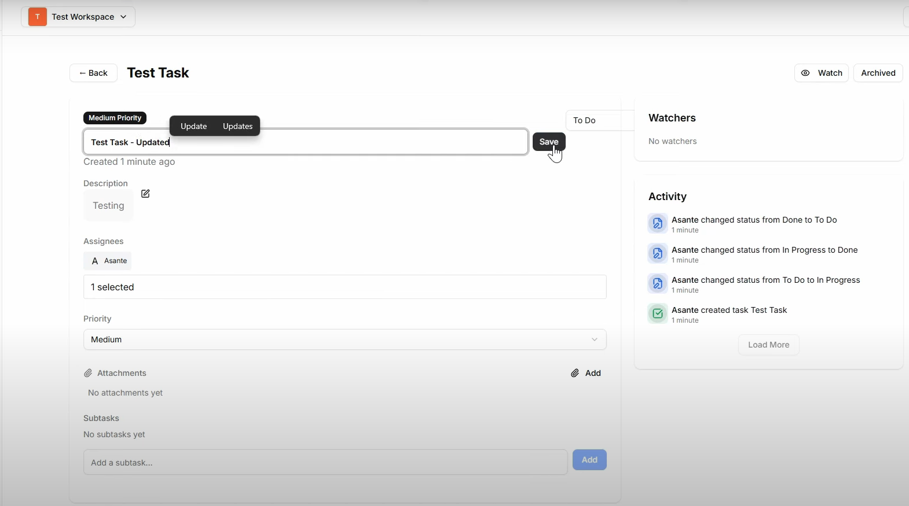 |
| **Task Stats** | 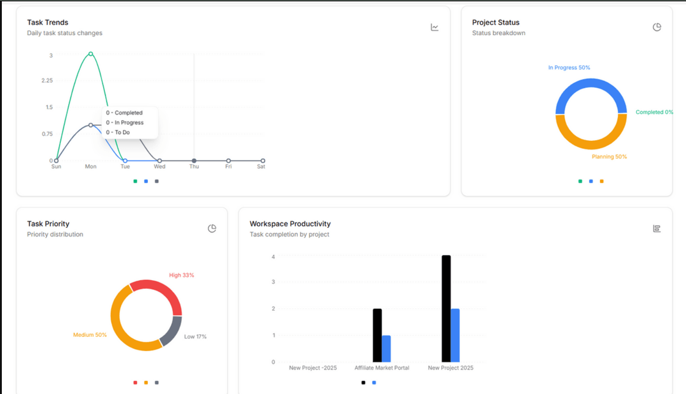 |
| **Invite Members** | 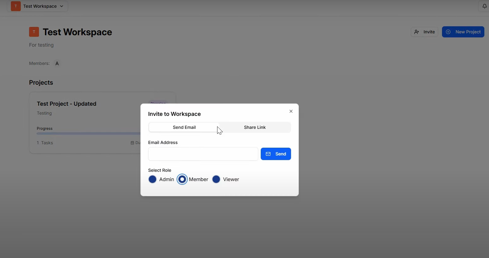 |
| **Email Invitation** | 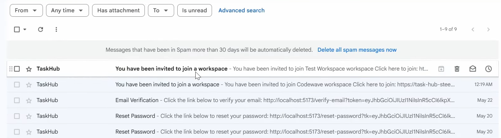 |
| **Workspaces** | 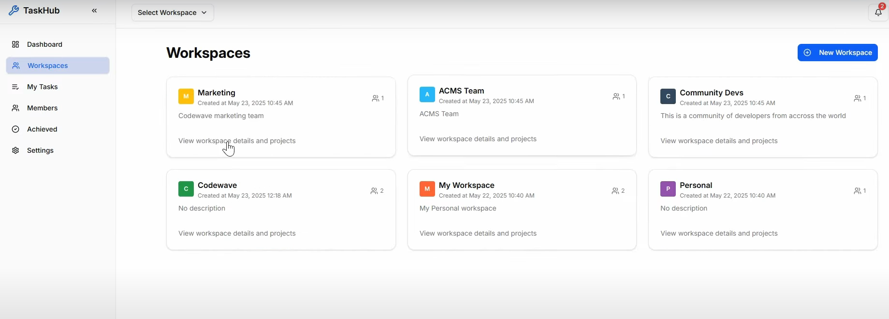 |
| **Invitation Management** | 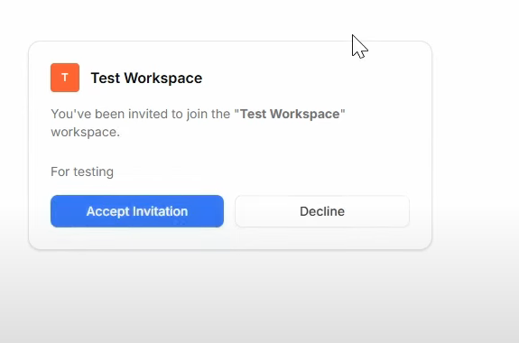 |
| **Workspace Edit** | 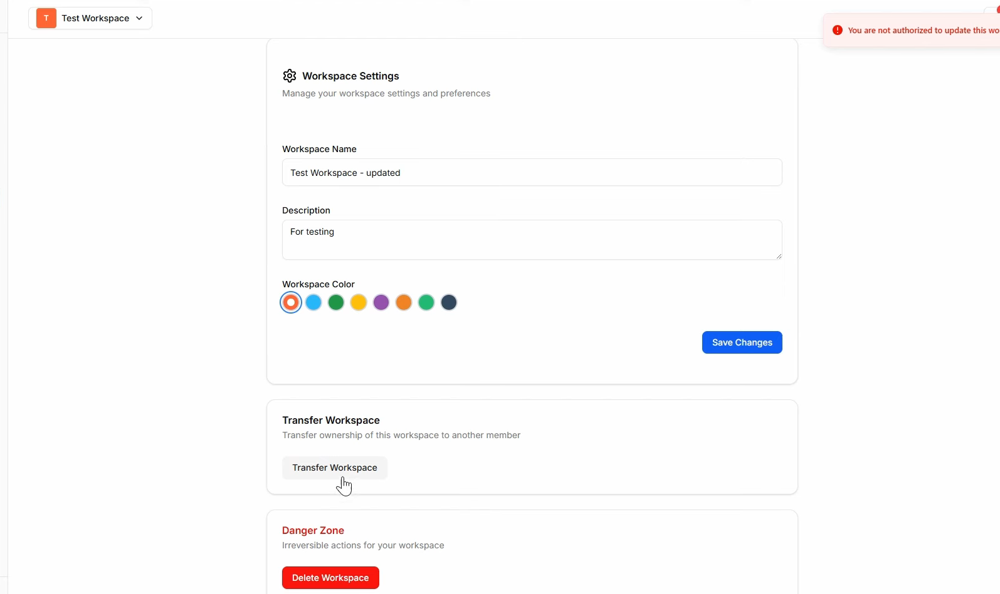 |
| **My Tasks** | 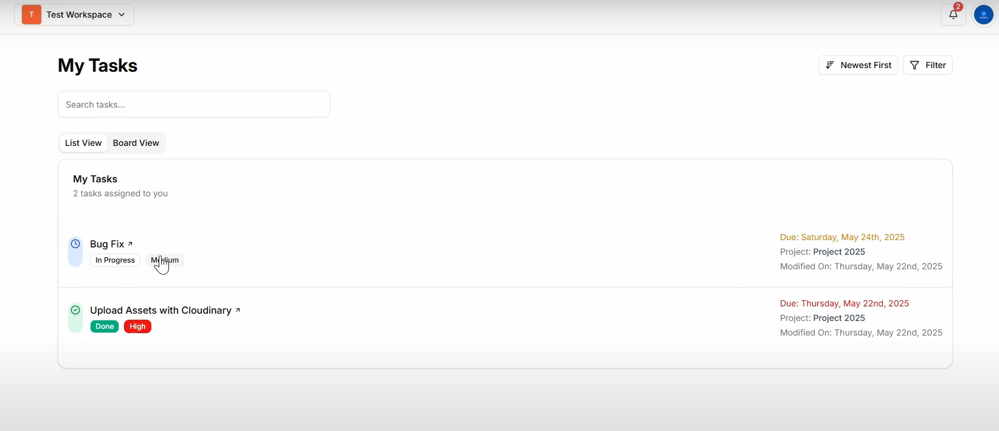 |
| **Dashboard** | 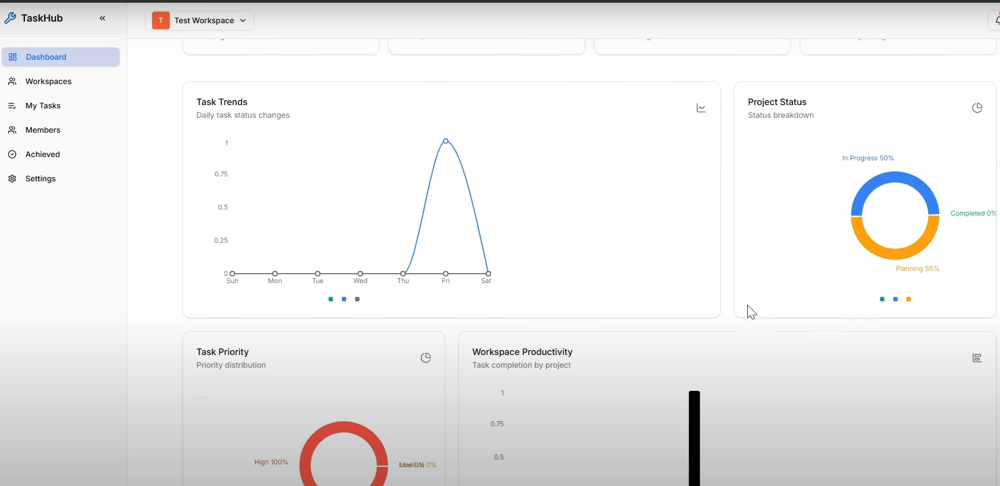 | 